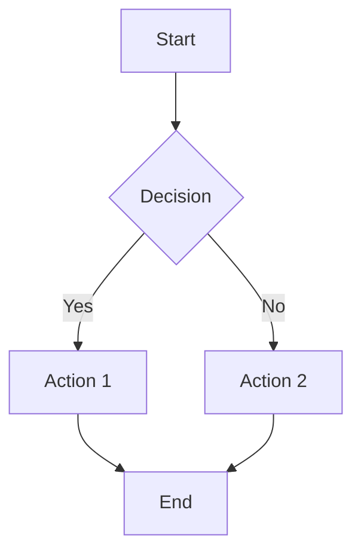
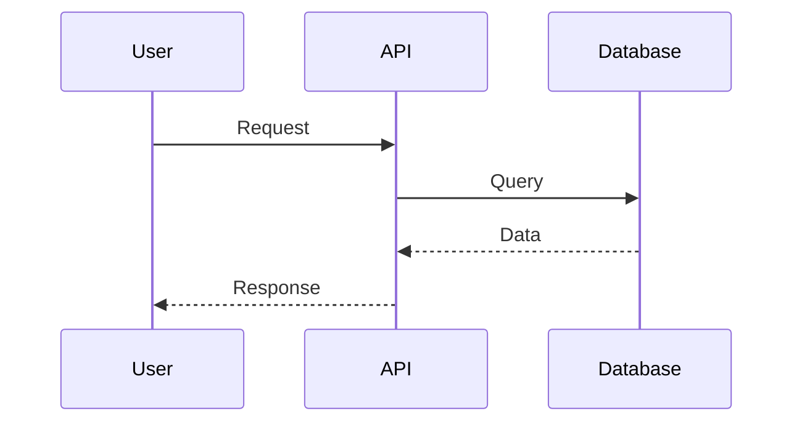
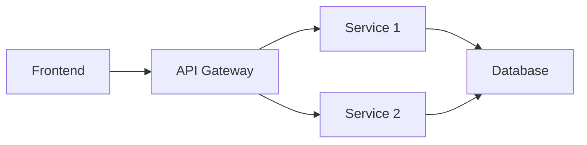

# Mermaid Diagram Feature

## Overview
The Choreo AI Assistant now automatically generates **Mermaid diagrams** when users ask about architecture, workflows, processes, or any visual explanations. This feature uses the knowledge base to create accurate, context-aware diagrams.

## How It Works

### 1. **Automatic Detection**
The system automatically detects when users ask diagram-related questions:
- "Show me the architecture..."
- "How does X work?"
- "Explain the flow..."
- "What happens when..."
- "Visualize..."
- "Diagram..."

### 2. **Intelligent Diagram Type Selection**
The AI chooses the best diagram type based on the question:
- **Flowchart**: Processes, workflows, CI/CD pipelines, decision flows
- **Sequence Diagram**: API interactions, service communications, authentication flows
- **Architecture Diagram**: System design, component relationships, high-level overviews
- **Class Diagram**: Component relationships, service architectures
- **State Diagram**: Lifecycles, deployment states, status transitions
- **ER Diagram**: Database schemas, data relationships

### 3. **Context-Aware Generation**
- Uses the knowledge base to create accurate diagrams
- Includes actual component names from Choreo
- Shows real workflows and interactions
- Based on ingested documentation and code

### 4. **Beautiful Rendering**
- Diagrams render directly in the chat interface
- Supports dark/light mode
- Interactive and zoomable
- Can be copied as markdown

## Example Queries

Try asking:
- **"Show me the Choreo deployment architecture"**
  → Generates an architecture diagram with components

- **"Explain how the CI/CD pipeline works"**
  → Creates a flowchart of the build and deploy process

- **"What happens when a user authenticates?"**
  → Shows a sequence diagram of the auth flow

- **"How do observability components interact?"**
  → Displays component relationships and data flows

- **"Explain the STS runtime flow"**
  → Generates a detailed sequence or flow diagram

## Technical Implementation

### Backend Components

1. **DiagramDetectionService** (`services/diagram_detection_service.py`)
   - Detects diagram-related queries
   - Determines appropriate diagram type
   - Enhances search queries for better context retrieval

2. **LLM Service** (`services/llm_service.py`)
   - Contains Mermaid instructions in system prompt
   - Guides the LLM to generate proper Mermaid syntax
   - Ensures diagrams are based on actual context

3. **API Endpoints** (`app.py`)
   - `/api/ask` - Returns diagram in response
   - `/api/ask/stream` - Streams diagram progressively

### Frontend Components

1. **MermaidDiagram Component** (`frontend/src/components/MermaidDiagram.jsx`)
   - Renders Mermaid diagrams using the `mermaid` library
   - Supports dark/light themes
   - Handles errors gracefully
   - Shows loading state

2. **Message Component** (`frontend/src/components/Message.jsx`)
   - Detects ```mermaid code blocks
   - Passes them to MermaidDiagram for rendering
   - Displays alongside text explanations

## Mermaid Syntax Examples

### Flowchart


### Sequence Diagram


### Architecture Diagram


## Configuration

### Backend
The feature is enabled by default. The LLM is instructed via:
- `get_mermaid_instructions()` in `llm_service.py`
- Dynamic prompt enhancement in `app.py`

### Frontend
Mermaid is pre-installed:
```json
{
  "dependencies": {
    "mermaid": "^11.12.2"
  }
}
```

## Testing

Run the test suite:
```bash
cd backend
python tests/test_diagram_feature.py
```

This verifies:
- ✅ Diagram query detection
- ✅ Diagram type classification
- ✅ Query enhancement
- ✅ Prompt enhancement generation

## Best Practices

### For Users
1. Be specific about what you want to see
2. Mention the components or processes you're interested in
3. Ask follow-up questions to refine diagrams

### For Developers
1. Diagrams are generated based on context from the knowledge base
2. Ensure relevant documentation is ingested for accurate diagrams
3. The system prioritizes high-quality context (score > 0.7)

## Monitoring

The system logs diagram-related events:
```python
monitoring.log_info(
    "Diagram query detected",
    logger_type='ai',
    diagram_type=diagram_type,
    query=question[:100]
)
```

## Resources

- **Mermaid Documentation**: https://mermaid.js.org/
- **Mermaid Live Editor**: https://mermaid.live/
- **NPM Package**: https://www.npmjs.com/package/mermaid

## Future Enhancements

Potential improvements:
- [ ] Export diagrams as images
- [ ] Edit diagrams interactively
- [ ] Diagram templates for common patterns
- [ ] Diagram versioning and history
- [ ] Share diagrams via URL

## Troubleshooting

### Diagram Not Rendering
1. Check browser console for Mermaid errors
2. Verify the syntax is valid at https://mermaid.live/
3. Ensure the code block uses ```mermaid

### Wrong Diagram Type
1. Be more explicit: "Show me a sequence diagram of..."
2. The AI will learn from the knowledge base

### Missing Components
1. Ensure relevant docs are ingested
2. Ask more specific questions
3. Provide context in your query
