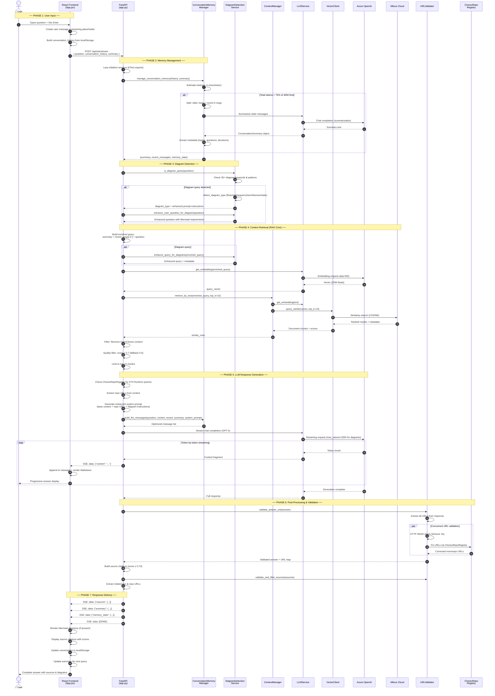
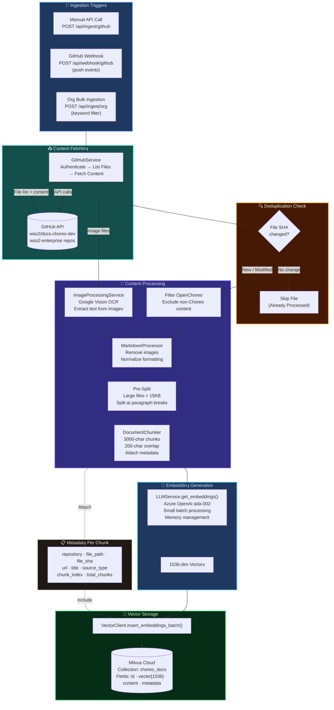
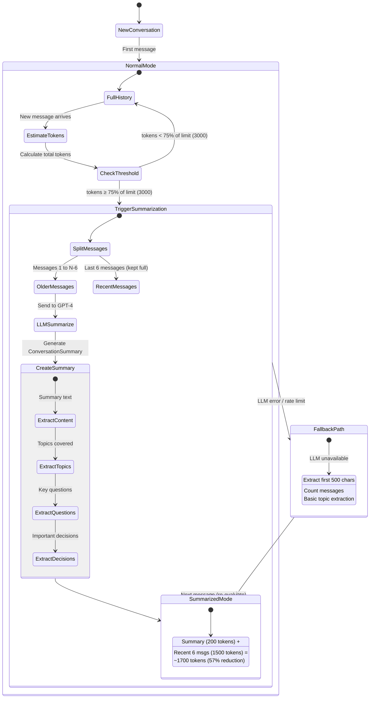
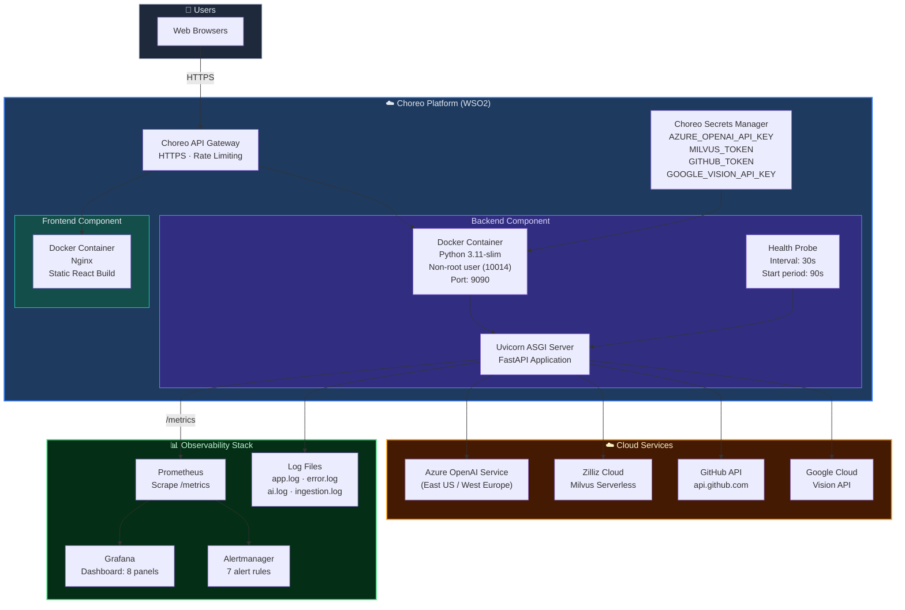
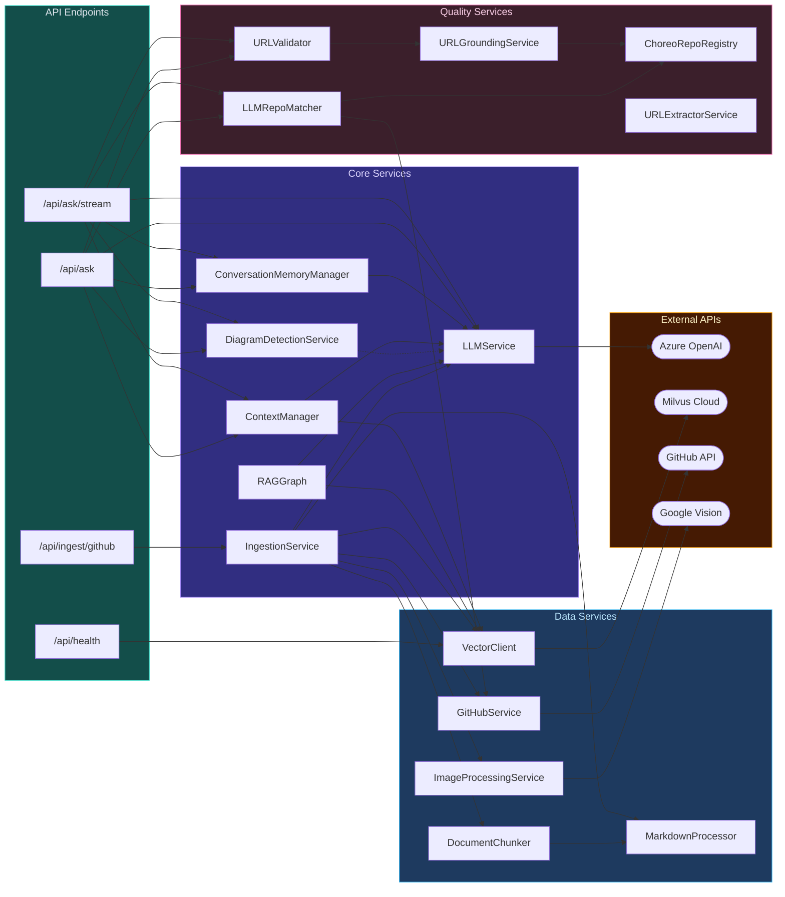

# DevChoreo — Full System Architecture

> **DevChoreo** is an AI-powered Retrieval-Augmented Generation (RAG) platform that serves as an intelligent assistant for the **WSO2 Choreo** developer platform. It ingests Choreo documentation from GitHub, stores it as vector embeddings in Milvus Cloud, and delivers streaming, context-aware answers through a modern ChatGPT-like interface — powered by Azure OpenAI GPT-4.

---

## 1. High-Level System Architecture

This diagram shows the complete system topology — every layer, every service, every external dependency, and how data flows between them.

```mermaid
graph TB
    %% ──────────────── USER LAYER ────────────────
    User(("👤 User"))

    %% ──────────────── FRONTEND LAYER ────────────────
    subgraph FRONTEND["🖥️ FRONTEND — React 18 + Vite + Tailwind CSS"]
        direction LR
        AppJSX["App.jsx<br/>Main Chat Shell"]
        ChatInput["ChatInput.jsx<br/>User Input"]
        MessageComp["Message.jsx<br/>Markdown Renderer<br/>Code Highlighting<br/>Source Citations"]
        MermaidDiag["MermaidDiagram.jsx<br/>Interactive Diagrams<br/>Zoom · Fullscreen"]
        SidebarComp["Sidebar.jsx<br/>Chat History<br/>Search · CRUD"]
        MonBtn["MonitoringButton.jsx<br/>📊 Grafana Link"]
        LocalStorage[("localStorage<br/>Conversations<br/>Theme Prefs")]
    end

    %% ──────────────── API GATEWAY LAYER ────────────────
    subgraph GATEWAY["🔀 API GATEWAY — FastAPI"]
        direction LR
        CORS["CORS<br/>Middleware"]
        MetricsMW["Metrics<br/>Middleware"]
        AskStream["/api/ask/stream<br/>SSE Streaming"]
        AskStd["/api/ask<br/>Standard JSON"]
        AskGraph["/api/ask_graph<br/>LangGraph RAG"]
        IngestEP["/api/ingest/github<br/>Doc Ingestion"]
        HealthEP["/api/health<br/>Health Probe"]
        MetricsEP["/metrics<br/>Prometheus"]
        WebhookEP["/api/webhook/github<br/>Push Events"]
    end

    %% ──────────────── CORE SERVICES LAYER ────────────────
    subgraph SERVICES["⚙️ CORE SERVICES"]
        direction TB

        subgraph AI_PIPELINE["🧠 AI & RAG Pipeline"]
            LLMSvc["LLMService<br/>Chat Completion<br/>Embedding Generation<br/>Streaming Support"]
            MemMgr["ConversationMemoryManager<br/>Token Tracking<br/>Smart Summarization<br/>75% Trigger Ratio"]
            CtxMgr["ContextManager<br/>Semantic Search Bridge<br/>Query → Embed → Retrieve"]
            DiagSvc["DiagramDetectionService<br/>Query Analysis<br/>Mermaid Type Detection<br/>Prompt Enhancement"]
            RAGGraph["RAGGraph<br/>LangGraph Workflows<br/>Multi-step Reasoning"]
        end

        subgraph DATA_PIPELINE["📦 Data Processing Pipeline"]
            IngSvc["IngestionService<br/>GitHub → Chunk → Embed → Store<br/>Incremental · SHA Dedup<br/>Memory-Efficient Batches"]
            Chunker["DocumentChunker<br/>3000-char chunks<br/>200-char overlap<br/>15KB pre-split"]
            GHSvc["GitHubService<br/>Repo Content Fetch<br/>Org-wide Bulk Ingestion<br/>File Listing · Auth"]
            MarkdownProc["MarkdownProcessor<br/>Clean · Normalize<br/>Remove Images"]
            ImgSvc["ImageProcessingService<br/>Google Vision OCR<br/>Text Extraction"]
        end

        subgraph QUALITY["✅ Quality & Validation"]
            URLVal["URLValidator<br/>Concurrent HTTP HEAD<br/>Smart Caching<br/>404 Prevention"]
            URLGround["URLGroundingService<br/>Link Correctness<br/>Registry Lookup"]
            RepoReg["ChoreoRepoRegistry<br/>30+ Components<br/>wso2/choreo-iam Monorepo<br/>URL Auto-Fix"]
            RepoMatcher["LLMRepoMatcher<br/>Intelligent Repo Search<br/>Context-Aware Matching"]
            URLExtract["URLExtractorService<br/>Doc & Repo URL<br/>Categorization"]
        end
    end

    %% ──────────────── DATA LAYER ────────────────
    subgraph DATALAYER["💾 DATA LAYER"]
        VecClient["VectorClient<br/>PyMilvus SDK<br/>Batch Insert · Cosine Search<br/>Schema Management"]
        ConfigMgr["Config Manager<br/>.env · Environment Vars<br/>Azure · Milvus · GitHub · Google"]
    end

    %% ──────────────── EXTERNAL SERVICES ────────────────
    subgraph EXTERNAL["☁️ EXTERNAL SERVICES"]
        direction LR
        AzureChat["Azure OpenAI<br/>GPT-4<br/>Chat Completions"]
        AzureEmbed["Azure OpenAI<br/>text-embedding-ada-002<br/>1536 Dimensions"]
        MilvusDB[("Milvus Cloud<br/>Zilliz Serverless<br/>Cosine Similarity<br/>Vector Storage")]
        GitHubAPI["GitHub API<br/>Repository Content<br/>Webhooks"]
        GoogleVision["Google Vision<br/>Cloud OCR API"]
    end

    %% ──────────────── OBSERVABILITY ────────────────
    subgraph OBSERVABILITY["📊 OBSERVABILITY"]
        direction LR
        PromSvc["Prometheus<br/>23+ Metrics"]
        GrafSvc["Grafana<br/>8-Panel Dashboard"]
        AlertMgr["Alertmanager<br/>7 Alert Rules"]
        Logs["Structured Logging<br/>JSON · Rotation<br/>app · error · ai · ingestion"]
    end

    %% ──────────────── CONNECTIONS ────────────────
    User -->|"HTTPS"| FRONTEND
    AppJSX <--> LocalStorage
    FRONTEND -->|"REST + SSE Stream"| GATEWAY

    CORS --> AskStream
    CORS --> AskStd
    CORS --> AskGraph
    CORS --> IngestEP
    MetricsMW --> MetricsEP

    AskStream --> LLMSvc
    AskStream --> MemMgr
    AskStream --> CtxMgr
    AskStream --> DiagSvc
    AskStream --> URLVal
    AskStd --> LLMSvc
    AskGraph --> RAGGraph
    IngestEP --> IngSvc
    WebhookEP --> GHSvc
    HealthEP --> VecClient

    LLMSvc -->|"Chat · Stream"| AzureChat
    LLMSvc -->|"Embeddings"| AzureEmbed
    CtxMgr --> VecClient
    CtxMgr --> LLMSvc
    MemMgr --> LLMSvc
    DiagSvc --> LLMSvc

    IngSvc --> GHSvc
    IngSvc --> Chunker
    IngSvc --> LLMSvc
    IngSvc --> VecClient
    GHSvc --> GitHubAPI
    IngSvc --> ImgSvc
    ImgSvc --> GoogleVision
    IngSvc --> MarkdownProc

    URLVal --> URLGround
    URLGround --> RepoReg
    RepoMatcher --> GHSvc

    VecClient -->|"PyMilvus"| MilvusDB
    GATEWAY --> PromSvc
    PromSvc --> GrafSvc
    PromSvc --> AlertMgr
    GATEWAY --> Logs

    %% ──────────────── STYLES ────────────────
    style FRONTEND fill:#1e3a5f,stroke:#60a5fa,stroke-width:2px,color:#e2e8f0
    style GATEWAY fill:#134e4a,stroke:#2dd4bf,stroke-width:2px,color:#e2e8f0
    style SERVICES fill:#1e1b4b,stroke:#818cf8,stroke-width:2px,color:#e2e8f0
    style AI_PIPELINE fill:#312e81,stroke:#a78bfa,stroke-width:1px,color:#ddd6fe
    style DATA_PIPELINE fill:#1e3a5f,stroke:#38bdf8,stroke-width:1px,color:#bae6fd
    style QUALITY fill:#3b1f2b,stroke:#f472b6,stroke-width:1px,color:#fbcfe8
    style DATALAYER fill:#1c1917,stroke:#a8a29e,stroke-width:2px,color:#e7e5e4
    style EXTERNAL fill:#451a03,stroke:#f59e0b,stroke-width:2px,color:#fef3c7
    style OBSERVABILITY fill:#052e16,stroke:#4ade80,stroke-width:2px,color:#bbf7d0
```



---

## 2. Complete RAG Query Pipeline — Step by Step

This sequence diagram traces the complete journey of a user question through every phase of the system — from typing in the browser to receiving a streaming answer.



---

## 3. Data Ingestion Pipeline

This flow shows how Choreo documentation is ingested from GitHub repositories, processed, and stored as searchable vector embeddings.



---

## 4. Conversation Memory Management Flow

This diagram shows how the intelligent memory system maintains conversation context across long conversations while staying within token limits.



---

## 5. Deployment Architecture



---

## 6. Service Dependency Graph

This shows which services depend on what — critical for understanding the initialization order and coupling.



---

## 7. Detailed Component Reference

### 7.1 Frontend Components

| Component | File | Lines | Key Responsibilities |
|---|---|---|---|
| **App** | `App.jsx` | 965 | Main app shell. Manages chat state, SSE streaming with `ReadableStream`, conversation CRUD, dark/light theme, localStorage persistence, search, auto-resize textarea. Fallback to REST on stream failure. |
| **ChatInput** | `ChatInput.jsx` | ~40 | Text input component with submit handler. Passes question to parent `sendQuestion()`. |
| **Message** | `Message.jsx` | ~620 | Renders user/assistant messages. Markdown rendering with syntax highlighting. Displays source citations with relevance scores. Copy-to-clipboard, edit question, and regenerate actions. |
| **MermaidDiagram** | `MermaidDiagram.jsx` | ~880 | Detects `mermaid` code blocks in responses. Renders interactive SVG diagrams with zoom controls (50%–300%), reset button, and fullscreen modal overlay. Dark/light theme adaptation. |
| **Sidebar** | `Sidebar.jsx` | ~130 | Multi-conversation management panel. Create, switch, rename (inline edit), delete conversations. Conversation search with live filtering. |
| **MonitoringButton** | `MonitoringButton.jsx` | ~110 | Floating 📊 button in the bottom-right corner that opens the Grafana monitoring dashboard. |

### 7.2 Backend API Endpoints

| Endpoint | Method | Handler | Description |
|---|---|---|---|
| `/api/ask/stream` | POST | `ask_ai_stream` | **Primary endpoint.** Full 7-phase RAG pipeline with SSE streaming. Includes memory management, diagram detection, context retrieval, GPT-4 streaming, URL validation. ~570 lines of logic. |
| `/api/ask` | POST | `ask_ai` | Standard (non-streaming) RAG query. Same pipeline as streaming but returns complete JSON. ~510 lines. |
| `/api/ask_graph` | POST | `ask_ai_graph` | LangGraph-based RAG with multi-step graph workflows for complex reasoning. |
| `/api/ingest/github` | POST | `ingest_github` | Ingest all markdown from a GitHub repository. Supports branch selection. |
| `/api/ingest/github/with-images` | POST | `ingest_github_with_images` | Ingest markdown + images (OCR via Google Vision). |
| `/api/ingest/org` | POST | `ingest_organization_repos` | Bulk ingest all repos from a GitHub organization, filtered by keyword (e.g., "choreo"). |
| `/api/webhook/github` | POST | `github_webhook` | Handles GitHub push webhooks for automatic re-ingestion of changed files. |
| `/api/health` | GET | `health_check` | Full health check: Milvus connectivity, all service status, component readiness. |
| `/metrics` | GET | `metrics` | Prometheus-compatible metrics in text format. 23+ custom metrics. |

### 7.3 Core Services Detail

| Service | File | Lines | Description |
|---|---|---|---|
| **LLMService** | `llm_service.py` | 854 | Multi-provider LLM wrapper. Azure OpenAI primary (GPT-4 chat + ada-002 embeddings). Supports streaming (`get_response_stream_with_history`) and standard modes. Includes Mermaid diagram instructions in system prompts. Memory-efficient batch embedding with `clear_model_cache()`. |
| **ConversationMemoryManager** | `conversation_memory_manager.py` | 471 | Token-based conversation management. Estimates tokens (~4 chars/token). Triggers auto-summarization at 75% of 4000-token limit. Keeps last 6 messages in full detail, summarizes older ones. Extracts metadata: topics, key questions, important decisions. Graceful fallback if LLM unavailable. |
| **ContextManager** | `context_manager.py` | 24 | Lean bridge between queries and Milvus. Converts text → embedding → vector search. Used by both ask endpoints. |
| **IngestionService** | `ingestion.py` | 1192 | Full ingestion pipeline. GitHub repo → file listing → SHA dedup check → content filtering → markdown cleaning → image OCR → pre-split (>15KB) → chunking (3000/200) → batch embedding → Milvus insert. Memory monitoring with `psutil`. Keyboard skip (`q` key) for long ingestions. |
| **GitHubService** | `github_service.py` | ~1300 | Complete GitHub API client. Repository content listing, file fetching, branch management, API rate limiting. Supports organization-wide bulk operations with keyword filtering. |
| **DiagramDetectionService** | `diagram_detection_service.py` | 452 | Analyzes queries for diagram intent using 30+ keywords and regex patterns. Detects diagram types: flowchart, sequence, architecture, state. Generates Mermaid-specific prompt enhancements. Enhances user questions to request professional-quality diagrams. |
| **URLValidator** | `url_validator.py` | ~1100 | Validates all URLs in LLM responses. Concurrent HTTP HEAD requests (max 10 parallel, 5s timeout). Smart caching of validation results. Removes 404/broken links. Fixes incorrect URLs via ChoreoRepoRegistry. |
| **ChoreoRepoRegistry** | `choreo_repo_registry.py` | ~1800 | Maps 30+ Choreo components to the `wso2/choreo-iam` monorepo. Validates and auto-corrects GitHub URLs (standalone repo → monorepo tree path). Handles STS Runtime Flow queries with injected domain knowledge. |
| **LLMRepoMatcher** | `llm_repo_matcher.py` | ~520 | Intelligent repository search. Extracts repo URLs from context and sources. Dynamic GitHub API queries. Formats repository listings. Registry-based fallback for comprehensive results. |

### 7.4 Data Layer

| Component | Details |
|---|---|
| **VectorClient** | PyMilvus SDK wrapper. Collection schema: `id` (VARCHAR, PK), `vector` (FLOAT_VECTOR, 1536 dims), `content` (VARCHAR), `metadata` (JSON). Cosine similarity metric. Batch inserts with UUID generation. SHA-based file dedup (`file_already_processed()`). Connection health testing. |
| **Milvus Cloud** | Zilliz Serverless. Zero infrastructure management. Auto-scales based on query volume. Stores all document embeddings with rich metadata (repo, file path, SHA, URL, title, chunk index). |

### 7.5 Monitoring Stack (23+ Metrics)

| Category | Metrics Count | Examples |
|---|---|---|
| **Infrastructure** | 8 | CPU usage, memory usage, disk usage, process count, system health |
| **Application** | 4 | HTTP requests (method/endpoint/status), request duration, active requests, errors by type |
| **AI-Specific** | 4 | Inference duration, inference success rate, token usage (input/output), payload sizes |
| **Vector Database** | 3 | Search duration, search operations count, results count distribution |
| **GitHub/Ingestion** | 3 | Ingestion duration, ingestion success rate, files processed by type |
| **Health** | 1 | Overall application health gauge |

---

## 8. Technology Stack

```mermaid
mindmap
    root(("DevChoreo<br/>Technology Stack"))
        Frontend
            React 18
            Vite (Build Tool)
            Tailwind CSS
            Mermaid.js
            Lucide Icons
            localStorage API
        Backend
            FastAPI (ASGI)
            Python 3.11+
            Uvicorn Server
            Pydantic
            LangChain
            LangGraph
        AI & ML
            Azure OpenAI GPT-4
            text-embedding-ada-002
            Sentence Transformers
            1536-dim Vectors
        Vector Database
            Milvus Cloud (Zilliz)
            PyMilvus SDK
            Cosine Similarity
        Integrations
            GitHub REST API
            GitHub Webhooks
            Google Vision API
        Infrastructure
            Docker (Python 3.11-slim)
            Choreo Platform (WSO2)
            Nginx (Frontend)
            Non-root Containers
        Observability
            Prometheus
            Grafana (8 panels)
            Alertmanager (7 rules)
            JSON Structured Logging
            Log Rotation
```

---

## 9. Key Architectural Decisions

| # | Decision | Rationale | Impact |
|---|---|---|---|
| 1 | **Lazy Service Initialization** | Services init on first request, not at startup. Keeps cold-start under 5 seconds. | Prevents Choreo gateway 504 timeouts. Health probes respond instantly. |
| 2 | **SSE Streaming (Server-Sent Events)** | Tokens delivered progressively like ChatGPT. | First-token latency: 1–2s vs 3–5s for full response. Better UX. |
| 3 | **75% Token-Based Summarization** | Auto-summarize at 75% of 4000-token limit. Keep last 6 messages full. | Long conversations remain coherent. ~57% token reduction after summarization. |
| 4 | **Multi-Stage Content Filtering** | OpenChoreo filtered at retrieval → context → display. | Guaranteed accuracy: answers based only on WSO2 Choreo platform. |
| 5 | **SHA-Based Incremental Ingestion** | Check file SHA before processing. Skip unchanged files. | Re-ingestion of large repos is 10x+ faster. |
| 6 | **Concurrent URL Validation** | HTTP HEAD checks with 10 parallel workers, 5s timeout, result caching. | No broken links in citations. Minimal latency overhead. |
| 7 | **Monorepo-Aware URL Correction** | ChoreoRepoRegistry maps 30+ components to `wso2/choreo-iam` tree paths. | Auto-fixes legacy standalone-repo URLs in LLM responses. |
| 8 | **3000-char Chunks with 200-char Overlap** | Balance between context completeness and embedding quality. Pre-split at 15KB. | Optimal retrieval granularity. No chunking timeouts for large files. |
| 9 | **Automatic Fallback Patterns** | Stream → REST fallback. LLM summarization → simple fallback. | System remains functional even when individual components fail. |
| 10 | **Non-root Docker Container** | User ID 10014, minimal system deps, cache purging. | Security best practice. Smaller image size. |

---

## 10. Data Flow Summary

```
┌──────────────────────────────────────────────────────────────────────────────┐
│                          TWO PRIMARY DATA FLOWS                              │
├──────────────────────────────────────────────────────────────────────────────┤
│                                                                              │
│  📥 INGESTION FLOW (Batch, Async)                                            │
│  ┌─────────┐    ┌──────────┐    ┌──────────┐    ┌───────┐    ┌──────────┐  │
│  │ GitHub   │ →  │ Process  │ →  │  Chunk   │ →  │ Embed │ →  │  Milvus  │  │
│  │ Repos    │    │ Markdown │    │ 3000/200 │    │ ada-2 │    │  Cloud   │  │
│  └─────────┘    └──────────┘    └──────────┘    └───────┘    └──────────┘  │
│                                                                              │
│  🔍 QUERY FLOW (Real-time, Streaming)                                        │
│  ┌─────────┐    ┌──────────┐    ┌──────────┐    ┌───────┐    ┌──────────┐  │
│  │ User     │ →  │ Memory   │ →  │ Retrieve │ →  │ GPT-4 │ →  │ Stream   │  │
│  │ Question │    │ Manager  │    │ Context  │    │ Gen.  │    │ Answer   │  │
│  └─────────┘    └──────────┘    └──────────┘    └───────┘    └──────────┘  │
│                                                                              │
└──────────────────────────────────────────────────────────────────────────────┘
```

---

> **Document Version:** 2.0  
> **Last Updated:** February 2026  
> **Source:** Generated from full source code analysis of all project files  
> **Maintained by:** DevChoreo Team
