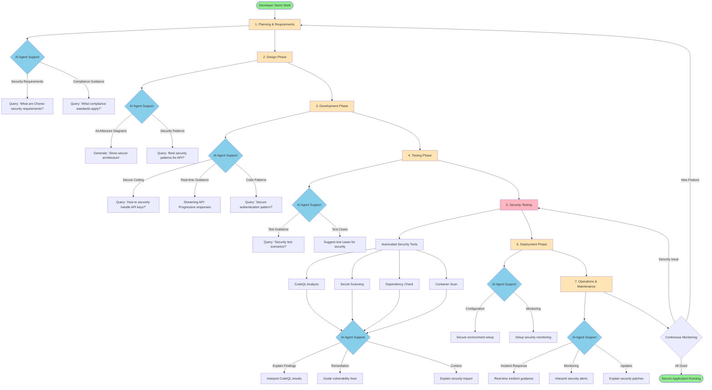
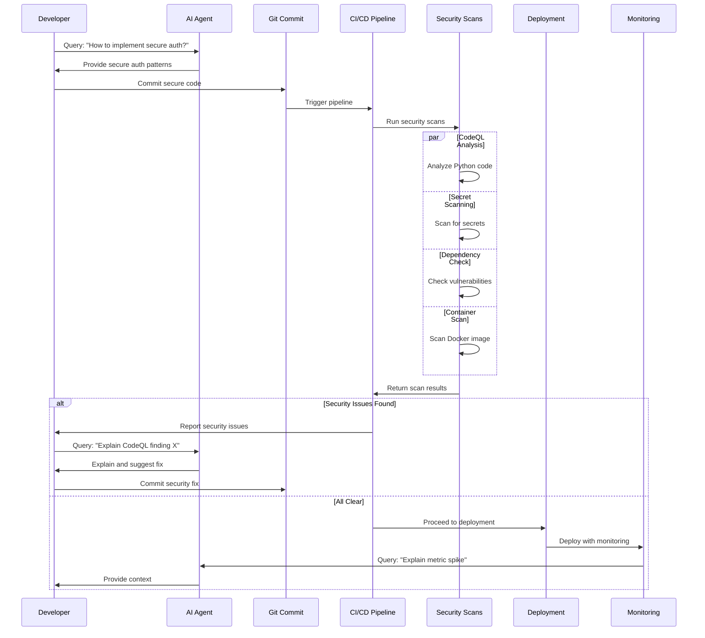
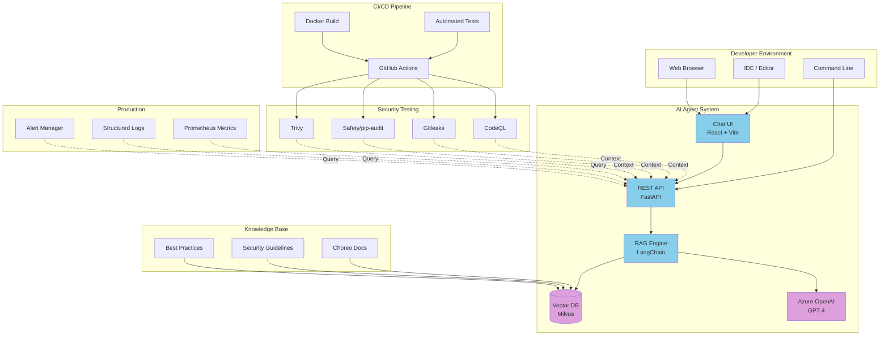
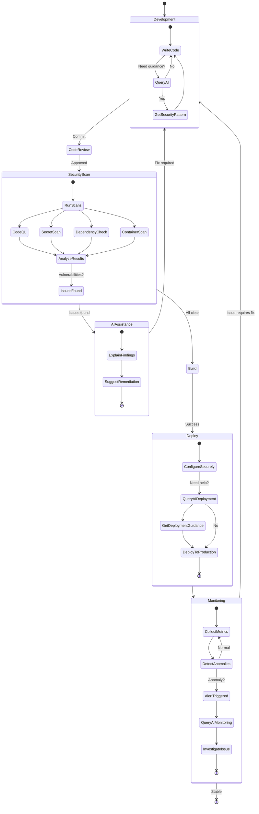
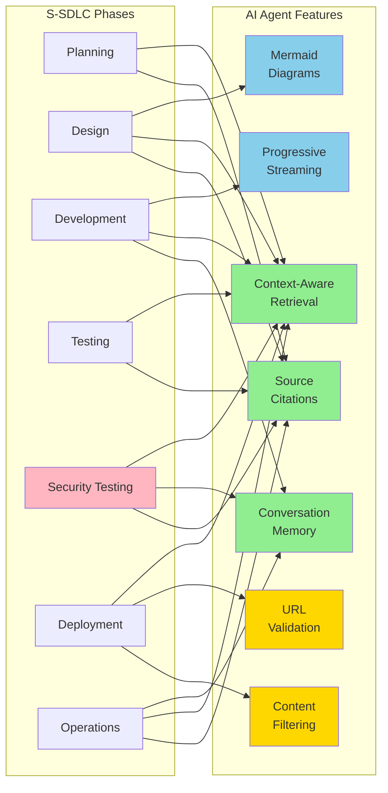

# S-SDLC Integration Diagram

This document contains visual representations of how the AI agent integrates into the S-SDLC.

## AI Agent in S-SDLC Phases - Mermaid Diagram



## Security Pipeline Integration



## AI Agent Architecture in S-SDLC Context



## Security Workflow with AI Support



## AI Agent Feature Support Across S-SDLC



## How to Use These Diagrams

### For Documentation
Copy these Mermaid diagrams into:
- Architecture documentation
- Security policies
- Developer onboarding materials
- Compliance reports

### For Presentations
Render these diagrams using:
- Mermaid Live Editor: https://mermaid.live/
- GitHub Markdown rendering (automatic)
- Mermaid CLI tools
- Documentation generators (MkDocs, Sphinx)

### For Interactive Viewing
Use the AI agent itself:
```
Query: "Show me the S-SDLC integration diagram"
Query: "Explain the security pipeline workflow"
Query: "Diagram how AI supports each SDLC phase"
```

The AI agent can generate these and similar diagrams on-demand!
